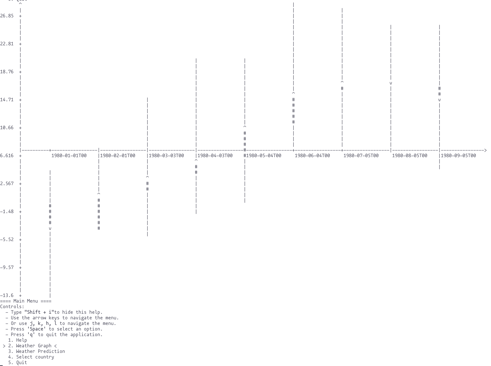

# Ascii data visualisation
Started as a midterm assignment for university, I liked the idea to visualise different kind of data in terminal. 
Generall purpose data visualisation app.

CLI synapsis - WIP

Reads CSV -> returns a candlestick graph based on read data. 

Link to dataset to be put in `src/datasets/`
[weather_data](https://www.kaggle.com/datasets/mexwell/european-weather-data?select=weather_data.csv)
